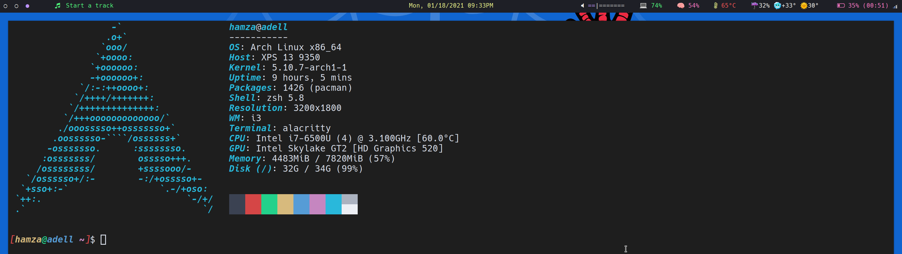

# Hamza's dotfiles

## Table of Contents

- [What are dotfiles](#what-are-dotfiles)
- [Programs used](#programs-used)
- [Configuration options](#configuration-options)

## What are dotfiles

Dotfiles are the customization files used to personalize your Linux system to your liking. Dotfiles
can be identified by the preceding dot/period. Since dotfiles start with a dot, these files are
hidden.

These are the dotfiles used on my systems. Dotfiles tend to be stored in a Git repository for
convenience sake when installing or using a new computer.

## Programs used

Settings for

- [calcurse](https://github.com/xJavaTheHutt/dotfiles/tree/master/.config/calcurse) (calendar)
- [i3-gaps](https://github.com/xJavaTheHutt/dotfiles/tree/master/.config/i3) (window manager)
- [neovim](https://github.com/xJavaTheHutt/dotfiles/tree/master/.config/nvim) (text editor)
- [polybar](https://github.com/xJavaTheHutt/dotfiles/tree/master/.config/polybar) (status bar)
- [lf](https://github.com/xJavaTheHutt/dotfiles/tree/master/.config/lf) (file manager)
- [alacritty](https://github.com/xJavaTheHutt/dotfiles/tree/master/.config/alacritty) (terminal
  emulator)
- [zsh](https://github.com/xJavaTheHutt/dotfiles/tree/master/.config/zsh) (shell)

## Configuration options

##### i3

1. Navigate to `~/.config/i3/`
2. Copy `config-desktop` or `config-laptop` to `config`
3. Adjust the monitor name(s) and workspace outputs for `$LEFT`, `$CENTER` and `$RIGHT`. Monitor
   names can be found by running `xrandr`

##### Polybar

1. Navigate to `~/.config/polybar/`
2. Copy `config-desktop` or `config-laptop` to `config`
